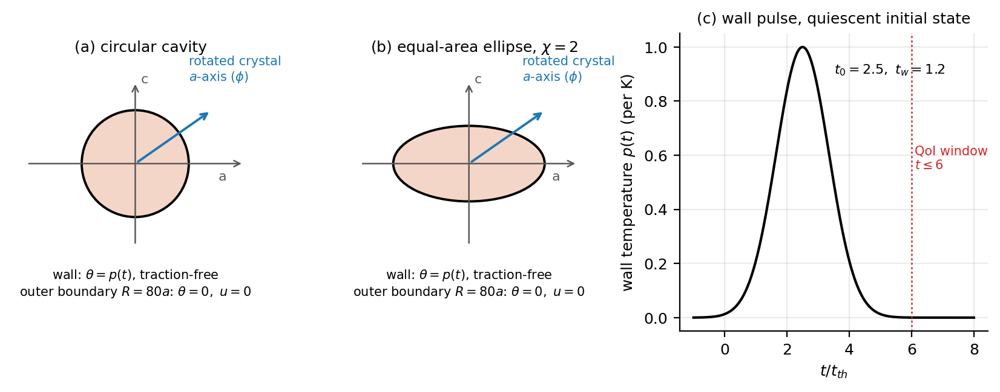
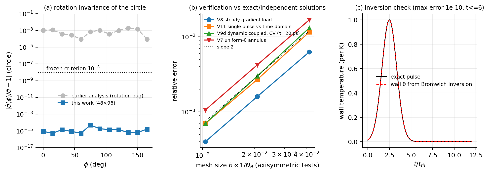
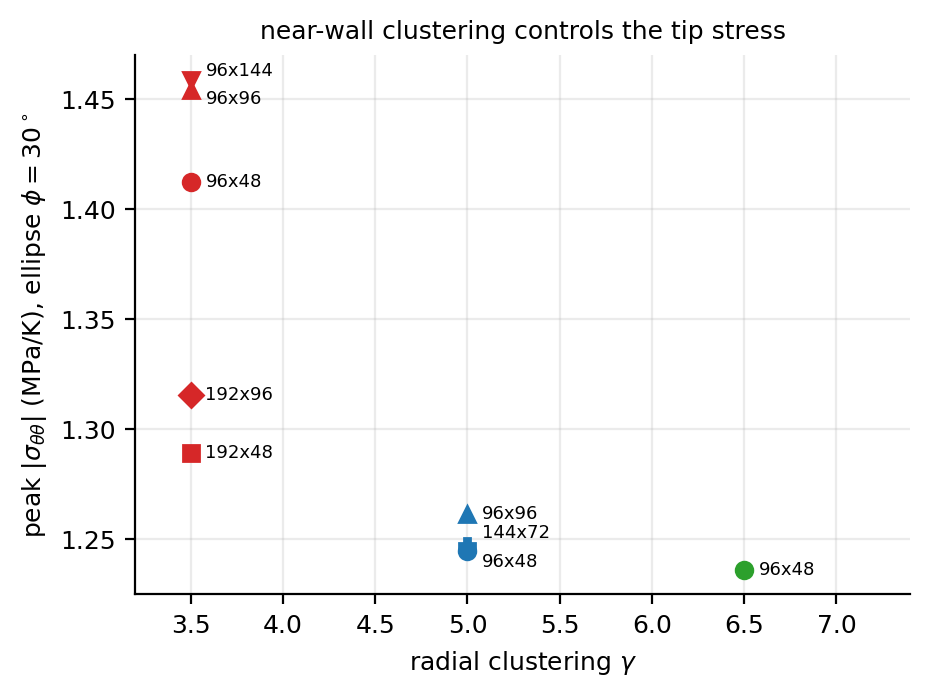
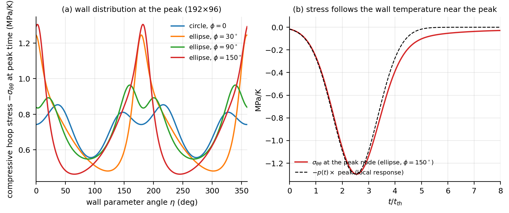
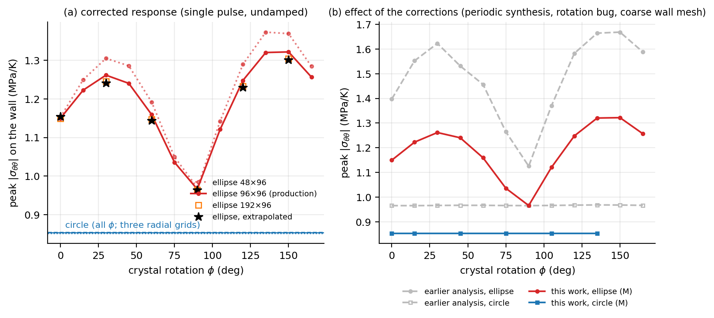
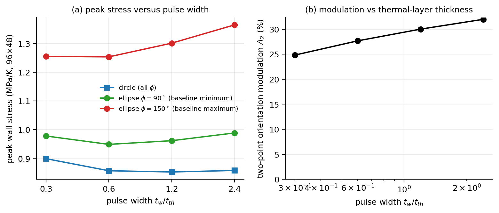
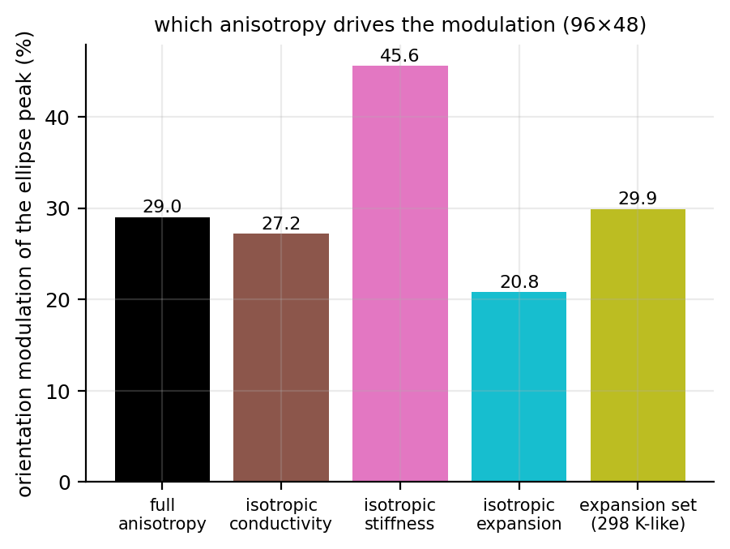
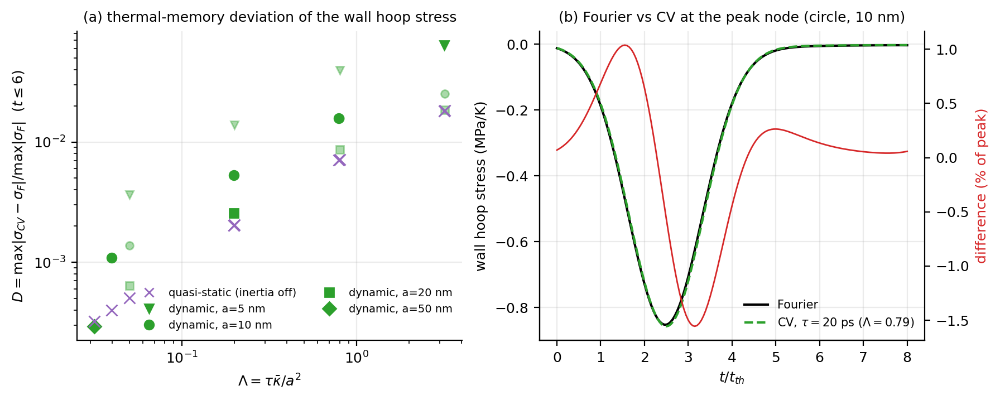

# Orientation-dependent wall stress around circular and elliptical cavities in monoclinic β-Ga₂O₃ under a transient thermal pulse: a verified continuum study with thermal-memory and mechanism ablations

*[Authors, affiliations and corresponding author: to be completed by the authors]*

## Abstract

Thermal stresses around cavities in low-symmetry crystals depend on how crystal orientation, cavity shape and heat-conduction law interact, but transient studies treat isotropic or highly symmetric media. We study monoclinic β-Ga₂O₃ with a circular and an equal-area elliptical cavity (axis ratio 2) under a Gaussian wall-temperature pulse in plane strain, with Fourier and Lord–Shulman conduction. The single-pulse response is obtained from a frequency-domain finite-difference solver by Bromwich inversion on a shifted contour and verified against exact and independent solutions (peak error 0.08% at the finest grid, second order); a periodic synthesis would return a pulse-train steady state instead. The peak wall stress of the circle is orientation-invariant to round-off and equals 0.854 MPa/K. The ellipse converts crystal orientation into a peak-stress modulation of 29% (numerical uncertainty 1.3 percentage points), resulting from competing expansion and stiffness anisotropy. Thermal memory (relaxation time up to 20 ps) changes the circular-cavity wall-stress history by at most 6.4% (1.6% for cavities of 10 nm and larger) and the peak by at most 1.4%; the size dependence is a quasi-static collapse in the memory number plus an elastic-inertia correction of order ε². Thermoelastic feedback stays below the bound 5δ. Results are properties of a verified continuum model: relaxation times are hypothetical, the expansion data are uncertain by more than an order of magnitude, continuum validity at 5–50 nm is not established, and there is no experimental validation.

**Keywords:** thermoelasticity; cavity; monoclinic crystal; β-Ga₂O₃; Lord–Shulman theory; Bromwich inversion

## Highlights

- Bromwich inversion gives a verified single-pulse thermoelastic cavity response
- Circular-cavity peak wall stress is orientation-invariant to round-off in beta-Ga2O3
- Ellipse converts crystal orientation into a 29% peak-stress modulation
- Thermal memory shifts the peak wall stress by under 1.4% for tau up to 20 ps
- Verified continuum study: no validation; stress scale uncertain via expansion

## 1. Introduction

Classical analyses of thermal stresses around holes and cavities in uniform heat flow are given in [1,2], and anisotropic plates with elliptic boundaries have been treated by complex-variable (Stroh-type) methods under steady conditions [3]. Transient cavity problems with a finite heat-wave speed have been solved for a fibre-reinforced anisotropic medium with a circular hole [4], for spherical cavities [5], for an orthotropic cylindrical cavity [7], and hole-shape effects have been studied in perforated composite plates [6]; boundary-element methods treat holes in general anisotropic discs and planes [8,9]. The generalized-thermoelasticity studies [4,5,7] concern isotropic or highly symmetric (fibre-reinforced, orthotropic) media and circular or spherical geometry, whereas the studies of general anisotropy and non-circular holes [3,8,9] are steady or quasi-static with Fourier conduction. Within the bounded literature search described in the data package we found no study that combines a low-symmetry crystal, a non-circular cavity, a systematic crystal-orientation sweep and a thermal-memory parameter in a transient coupled analysis (this is a statement about our search, not a claim of priority).

Coupled thermoelasticity [10] and its generalizations to a finite heat-wave speed are the framework for transient problems: the Lord–Shulman theory with one relaxation time [11] and its extension to anisotropic media with a uniqueness theorem [12]; dual-phase-lag and related models are discussed in [13] and reviewed in [14]. Monoclinic β-Ga₂O₃ is an ultra-wide-band-gap semiconductor whose elastic [15], thermal-conductivity [16] and thermal-expansion [17,18] tensors are all strongly anisotropic; its room-temperature elastic constants are well characterised [15] and its conductivity tensor has an off-diagonal component in the a–c plane [16], so that crystal orientation, cavity shape and heat-conduction law can interact. Whether this interaction is large enough to matter, and which observable is sensitive to it, is the question addressed here.

We study the transient coupled thermoelastic response of a circular and of an equal-area elliptical cavity (axis ratio 2) in a monoclinic crystal loaded in plane strain in the a–c plane by a Gaussian wall-temperature pulse, with Fourier, Cattaneo–Vernotte (Lord–Shulman) and a two-relaxation-time conduction law. The study is a **verified continuum parametric study**: the numerical results are verified against exact and independent solutions and their numerical uncertainty is quantified, but they are not compared with experiments, which are not available; the relaxation times are hypothetical and the continuum description is not claimed to hold at the nanometre scale (Section 6).

The contributions are: (i) a verified time-domain method that returns the response of a quiescent medium to a single pulse from a frequency-domain solver by Bromwich inversion on a shifted contour, with the verification chain and the numerical uncertainty reported; (ii) the orientation dependence of the peak wall stress for a circular and an elliptical cavity, including an ablation that separates the contributions of stiffness, thermal-expansion and conductivity anisotropy; (iii) an analytical scaling identity and a local-response result for the circular cavity that explain why thermal memory has a bounded, small effect on the wall stress and what the residual dependence on the cavity size is; (iv) a bound on the thermoelastic feedback. Section 2 states the model, Section 3 the method, Section 4 the verification, Section 5 the results, Section 6 the discussion and limitations.

## 2. Model and parameters

### 2.1 Governing equations

Linear, small-strain thermoelasticity in plane strain is considered in the a–c plane of a monoclinic crystal (unique axis b normal to the plane). With temperature rise θ above the reference temperature T_{0} = 293 K, displacement u = (u_{1}, u_{3}) and Voigt strain ε = (ε_{11}, ε_{33}, γ_{13}), the constitutive law is σ = Qε − βθ (Biot [10]); Q is the 3×3 plane-strain block of the stiffness (only C_{11}, C_{13}, C_{15}, C_{33}, C_{35}, C_{55} enter) and β = Cα the thermal-stress vector, which also involves C_{12}, C_{23}, C_{25} through the b-axis expansion. Momentum balance and the heat equation with one relaxation time τ (Cattaneo–Vernotte flux law with energy balance, i.e. the Lord–Shulman equation [11,12]) read

$$ \nabla\cdot\boldsymbol{\sigma}=\rho\,\ddot{\mathbf{u}},\qquad \nabla\cdot(\mathbf{K}\nabla\theta)=\left(1+\tau\,\partial_t\right)\left(\rho c_p\,\dot\theta+T_0\,\boldsymbol{\beta}:\dot{\boldsymbol{\varepsilon}}\right) \qquad (1) $$

In the Laplace domain (variable s) the heat equation becomes ∇·(K g(s) ∇θ) = s(ρc_{p}θ + T_{0}β:ε) with g = 1 for Fourier conduction and g = 1/(1 + sτ) for the relaxation-time law. A two-relaxation-time kernel g = ½/(1 + ½sτ) + ½/(1 + 2sτ) is used as an exploratory sensitivity kernel (it is positive real, hence passive, but is not derived from a free energy). The medium is quiescent before the pulse; the cavity wall has θ = p(t) = exp(−((t − t_{0})/t_{w})²) with t_{0} = 2.5 t_{th}, t_{w} = 1.2 t_{th} and is traction-free; the outer boundary at R = 80a is clamped (u = 0) and cold (θ = 0). The cavity is a circle of radius a or an ellipse of semi-axes a√χ and a/√χ (equal area, χ = 2) whose major axis is parallel to the crystal a-axis at rotation φ = 0; the crystal is rotated by φ in the plane.

**Fig. 1.** Problem set-up: (a) circular and (b) equal-area elliptical cavity in the a–c plane of the crystal (crystal rotated by φ); (c) wall-temperature pulse and quantity-of-interest window.

### 2.2 Dimensionless groups

The thermal time is t_{th} = a²/κ̄ with κ̄ = (det K)^{1/2}/(ρc_{p}) = 3.959×10^{−6} m²/s (t_{th} = 25.3 ps at a = 10 nm). The memory number is Λ = τ/t_{th} = τκ̄/a² (Λ = 0.040, 0.198, 0.792 for τ = 1, 5, 20 ps at 10 nm); the elastic number is ε = κ̄/(c_{ref}a) with c_{ref} = (C_{33}/ρ)^{1/2} = 7686 m/s (ε = 0.0515 at 10 nm); the feedback number is δ = T_{0}β·β/(ρc_{p}C̄) = 1.078×10^{−3}. With the outer boundary at R = 80a the first return of the longitudinal wave to the wall occurs at t_{echo} = 2(R/a − 1)ε t_{th} = 16.3, 8.14, 4.07 and 1.63 t_{th} for a = 5, 10, 20, 50 nm. All stresses are reported per kelvin of wall-temperature amplitude (MPa/K).

### 2.3 Material parameters

**Table 1.** Parameters of the study and their status (MASTER_PROMPT classification: literature / assumed / hypothetical / design).

| Parameter | Value | Class | Source |
|---|---|---|---|
| C_{ij} (13 constants) | C11 242.8, C22 343.8, C33 347.4, C44 47.8, C55 88.6, C66 104.0, C12 128.0, C13 160.0, C23 70.9, C15 −1.62, C25 0.36, C35 0.97, C46 5.59 GPa | literature | Adachi et al. [15] (values checked against the paper) |
| K (a–c block) | [[12.13, −0.992], [−0.992, 14.09]] W/(m K); eigenvalues 11.72, 14.50 | literature | Klimm et al. [16] |
| α (a, b, c) | (1.54, 3.37, 3.15)×10^{−6} 1/K; α_{5} = 0 | literature (secondary-quoted); uncertain | Orlandi et al. [17]; at 298 K the synchrotron data [18] give values ≈10× smaller |
| ρ | 5880 kg/m³ | literature | compilations; Klimm et al. [16] use 5.961 g/cm³ at 20 °C |
| c_{p} | 560 J/(kg K) | assumed | reported values 485–537 J/(kg K) [19]; enters only t_{th}, δ and the dimensional labels |
| τ | 1, 5, 20 ps (Λ = 0.04–0.8 at 10 nm) | hypothetical (sensitivity-only) | order-of-magnitude estimates (κ ≈ 15 W/(m K), ρc_{p} = 3.3 MJ/(m³ K), v ≈ 4 km/s): gray τ = 3κ/(ρc_{p}v²) ≈ 0.9 ps; phonons with the longest mean free path (≈ 0.7 µm [20]) τ ≈ 0.2 ns |
| R/a, pulse | 80; t_{0} = 2.5, t_{w} = 1.2 t_{th} | design | pre-registered |
| a | 5–50 nm (10 nm reference) | design | continuum validity not established (Section 6) |

### 2.4 Quantities of interest

The primary observable is the peak of the absolute wall hoop stress |σ_{θθ}| over the wall and over 0 ≤ t ≤ 6 t_{th} (the window ends before the first elastic echo for a ≤ 10 nm). Two versions are reported: the nodal maximum over the wall nodes and the maximum of the spectrally (trigonometrically) interpolated wall profile; the latter removes the nodal quantisation of the angular maximum, which is of order (Δϑ)² and not negligible on coarse grids. The orientation modulation of the ellipse is A_{φ} = (max_{φ}σ̂ − min_{φ}σ̂)/mean_{φ}σ̂. The thermal-memory deviation is D = max|σ_{CV} − σ_{F}|/max|σ_{F}| over the wall and 0 ≤ t ≤ 6 t_{th} for the same grid and the same inversion plan.

### 2.5 Two analytical results

**Scaling.** For ρ → 0 (quasi-static elasticity) and δ → 0 (no thermoelastic feedback) the temperature problem in the variables (r/a, t/t_{th}) depends only on Λ, the geometry, the crystal orientation and R/a, and the stress per unit wall temperature is a linear functional of θ with no further length scale. The thermal-memory deviation D therefore depends on Λ alone (“collapse”), and any dependence on the cavity size at fixed Λ measures elastic inertia (ε) or feedback (δ).

**Local response of the isotropic circle.** For an isotropic body in quasi-static plane strain with a free wall and a clamped outer boundary, with Lamé constants λ, μ, m = λ + 2μ and γ_{T} = (3λ + 2μ)α, the wall hoop stress is

$$ \sigma_{\theta\theta}(a,t)=-\,2\mu\,g_T\,p(t)\;-\;\frac{2(\lambda+m)\,g_T\,F(t)}{R^{2}+(\lambda+m)\,a^{2}/(2\mu)},\qquad g_T=\frac{\gamma_T}{m},\quad F(t)=\int_a^R r\,\theta(r,t)\,dr \qquad (2) $$

with F ≲ a², so the second (far-field) term is of order (a/R)² ≈ 10^{−3} of the first: the peak wall stress is, to 0.1%, the local constraint response −2μ g_{T} p(t) (0.985 MPa/K for the Lamé constants of the isotropic control), whatever the heat-conduction law in the bulk. The expression follows from the radial equilibrium equation integrated once and the two boundary conditions; it is used here as an independent reference (Section 4) and as the basis of the interpretation in Section 5.

## 3. Numerical method

### 3.1 Spatial discretisation and frequency-domain solver

A body-fitted mapped polar grid with exponential radial clustering towards the cavity (parameter γ = 5) and a uniform periodic parametric angle is used; first derivatives are second-order finite differences with analytic metrics (one-sided at the two boundaries), and the heat and momentum operators are assembled in conservative flux form. For a complex frequency the system A(s) = A_{0} − s²A_{in} + sA_{d} + g(s)A_{lap} is solved by sparse LU with row equilibration and two steps of iterative refinement; the refinement lowers the forward-error floor of the stress from about 10^{−8} to 10^{−14}. Grids are labelled N_{r}×N_{θ}: R48 = 48×96, T48 = 96×48, M = 96×96 (production), R192 = 192×96 and T144 = 96×144.

### 3.2 Single-pulse response by Bromwich inversion

The time-domain response of the quiescent medium to one pulse is obtained from the transfer function H(s) (unit wall amplitude) evaluated on the vertical line Re s = γ_{B} > 0 and inverted with the trapezoidal Bromwich sum [21,22]. With the two-sided Laplace transform of the pulse, P(s) = √π t_{w} exp((s t_{w}/2)² − s t_{0}), and Y = H P,

$$ y(t)=\frac{e^{\gamma_B t}}{T}\left[Y(\gamma_B)+2\,\mathrm{Re}\sum_{k=1}^{K}Y(\gamma_B+i\omega_k)\,e^{i\omega_k t}\right],\qquad \omega_k=\frac{2\pi k}{T} \qquad (3) $$

with T = 20 t_{th}, γ_{B} = 0.9/t_{th}: the alias error is e^{−γ_{B}T} = 1.5×10^{−8}, the Gaussian spectrum is truncated at 10^{−10} (K = 26, i.e. 27 solves per run), and the result is valid for 0 ≤ t ≤ 14.5 t_{th}. The real symmetry H(s̄) = conj H(s) of the undamped real system is used. Because the evaluation line lies at distance γ_{B} from the resonances of the finite undamped domain, no artificial damping is needed. The reconstruction of the wall temperature returns the Gaussian to better than 10^{−8} (10^{−10} for t ≤ 6 t_{th}), a check carried out in every run. A periodic discrete-Fourier synthesis over a window of a few thermal times must not be used for this purpose: it returns the periodic steady state of a pulse train (here with a mean wall temperature of 0.27 of the peak, which builds a steady temperature profile out to the outer boundary and raises the clamped-boundary stress), not the single-pulse response.

### 3.3 Numerical uncertainty

Grid convergence is assessed with two refinement families at fixed other direction: radial (R48, M, R192; N_{θ} = 96) and angular (T48, M, T144; N_{r} = 96). For each orientation the observed order is obtained from the three levels, the Richardson-extrapolated value is formed with the observed order bounded to [1, 3], and the extrapolated value is M + (radial correction) + (angular correction). The numerical uncertainty of the orientation modulation is the largest of the differences between the amplitude on grid M and the amplitudes on R192, T144 and the extrapolated values. The radial clustering parameter was chosen from a mesh-direction study (Section 4.2).

Software and AI assistance (Methods disclosure): the finite-difference solver of the preliminary analysis was reviewed, corrected where noted, extended and verified with the help of an AI agent (Section 4 lists the tests; code, tests and raw data are in the data package). All numbers in this paper are produced by the analysis scripts from stored raw outputs.

## 4. Verification and numerical uncertainty

Verification is separated from validation: every comparison below is against an exact solution or an independent implementation of the same mathematical model (a 1-D axisymmetric Chebyshev solver in the Laplace domain and a time-domain Crank–Nicolson heat solver with the closed-form Lamé stress); none is a comparison with measurements. The suite has 28 tests (26 passed, 1 failed, 1 exploratory; the failure is discussed below).

### 4.1 Component and reference tests

**Table 2.** Summary of the verification suite (full table: supplementary material).

| Quantity | Reference | Result |
|---|---|---|
| Rotation of the stiffness/expansion tensors (27 angles) | independent 3-D rank-4 rotation | 1.6e-16 (a sign error in one cross-term would give 1.7e-03) |
| Rotation covariance of the circle (θ, u, wall hoop stress; all lattice φ, complex s) | exact discrete identity | 6.5e-14; peak-stress spread 3.6e-15; a test at φ = 90° alone is blind to the sign error (6e-14 vs 3.0e-03 at 45°) |
| Bromwich inversion: identity / damped oscillator / contour independence | exact / ODE integration / (T, γ_B) change | 6.3e-09 / 5.0e-09 / 4.7e-09 |
| Laplace-domain 1-D solution + inversion vs time-domain solution (quasi-static, uncoupled) | Crank–Nicolson + Lamé | 6.5e-07 |
| Steady log temperature profile; uniform-θ annulus; steady gradient load (wall hoop) | closed forms | V6 3.6e-06 (θ, 192×96); V7 0.11%; V8 0.16% (96×48), 0.04% (192×96), order 1.97 |
| Single pulse, isotropic circle (quasi-static, uncoupled): peak | time-domain reference | 1.16%, 0.27%, 0.07% (48×24, 96×48, 192×96), orders 2.08, 2.05 |
| Dynamic coupled problem (inertia + feedback): wall-hoop peak, Fourier / CV / MCV3 | 1-D spectral + same inversion | 1.21%, 0.29%, 0.07% (Fourier; 48×24, 96×48, 192×96); worst of the four conduction laws at 192×96: 0.08% |
| Quasi-static switch; a = 50 nm (echo-dominated) | 1-D reference | 0.29%; 0.27% (96×48) |
| Metric consistency (linear field) | ≤ 5×10^{−3} | production grids ≤ 3.6e-03; the handoff-style 96×48 grid with χ = 2 gives 5.03×10^{−3} (reported failure of this criterion, angular-resolution dominated) |

**Fig. 2.** (a) Rotation invariance of the circular-cavity peak stress: earlier analysis (rotation-tensor sign error) versus this work; (b) errors of the axisymmetric verification tests versus mesh size; (c) wall-temperature reconstruction by the Bromwich inversion.

The thermal-memory deviation D is a small difference of two nearly equal series, so its accuracy was tested separately: relative to the 1-D reference the error of D is +10.3%, +2.6%, +0.7% (τ = 5 ps) and +21.9%, +5.2%, +1.3% (τ = 20 ps) on the 48×24, 96×48 and 192×96 grids. On the grid used for the circle thermal-memory runs (96×48) D is therefore accurate to a few percent; D changes by +0.6%, +2.3% between that grid and the production grid M for the two members of the equal-Λ pair.

### 4.2 Choice of the radial clustering

The sharp tip of the ellipse (radius of curvature 0.35a at the ends of the major axis) is the most demanding location. A mesh-direction study for the ellipse at φ = 30° (Table 3, Fig. 3) shows that the near-wall radial resolution, not the angular resolution, controls the tip stress: with the clustering of the earlier 96×48 grid (γ = 3.5) doubling N_{r} changes the peak by -8.7% while doubling N_{θ} changes it by +3.0%; increasing the clustering to γ = 5 at fixed 96×48 changes the peak by -11.9%, and γ = 6.5 changes it by only a further -0.7%. The clustering γ = 5 with N_{θ} = 96 was therefore adopted (grid M = 96×96).

**Fig. 3.** Mesh-direction study for the ellipse at φ = 30°: peak wall stress for different meshes and radial clusterings γ (labels: N_r×N_θ).

**Table 3.** Peak wall hoop stress of the ellipse at φ = 30° (MPa/K) for different meshes and radial clusterings γ (interpolated maximum).

| γ | 96×48 | 192×48 | 96×96 | 96×144 | 192×96 |
|---|---|---|---|---|---|
| 3.5 | 1.412 | 1.289 | 1.454 | 1.459 | 1.316 |
| 5.0 | 1.245 | — | 1.262 | — | — |
| 6.5 | 1.236 | — | — | — | — |

### 4.3 Grid convergence of the production quantities

**Table 4.** Peak wall hoop stress of the ellipse (MPa/K, interpolated maximum) on the grid families and the extrapolated value M + radial + angular correction (corrections relative to M).

| φ (deg) | R48 | M | R192 | T48 | T144 | extrapolated | radial corr. | angular corr. |
|---|---|---|---|---|---|---|---|---|
| 0 | 1.1522 | 1.1496 | 1.1490 | 1.1345 | 1.1525 | 1.1543 | -0.07% | 0.48% |
| 30 | 1.3053 | 1.2617 | 1.2455 | 1.2447 | 1.2645 | 1.2409 | -2.04% | 0.39% |
| 60 | 1.1920 | 1.1595 | 1.1476 | 1.1487 | 1.1612 | 1.1439 | -1.60% | 0.26% |
| 90 | 0.9700 | 0.9659 | 0.9642 | 0.9617 | 0.9666 | 0.9640 | -0.32% | 0.12% |
| 120 | 1.2896 | 1.2481 | 1.2334 | 1.2333 | 1.2506 | 1.2299 | -1.82% | 0.36% |
| 150 | 1.3694 | 1.3220 | 1.3048 | 1.3012 | 1.3254 | 1.3010 | -2.03% | 0.44% |

Changing the inversion plan from (T, γ_B) = (20, 0.9) to (32, 0.6) and (16, 1.1) changes the peak stress by 2.9e-10 and 3.5e-10 (series: 4.1e-10, 7.2e-10), i.e. the inversion is not a source of uncertainty at the level of interest.

Because the model is undamped and the outer boundary is finite, elastic echoes are features of the model. Doubling the outer radius (R = 160a, with N_{r} adjusted to keep the near-wall spacing) changes the peak wall stress by 0.29% for a = 10 nm (first echo at 8.1 t_{th}, outside the window) and by 0.18% for a = 50 nm (echo at 1.6 t_{th}, inside the window); the thermal-memory deviation D changes by -5.4% and -3.6%, which is of the size of the grid uncertainty of D (Section 4.1). The finite outer radius is therefore not a significant source of uncertainty for these observables.

## 5. Results

### 5.1 Circular cavity: orientation-invariant peak and local response

For the circular cavity the peak wall stress is 0.854 MPa/K on grid M, 0.854 MPa/K after radial extrapolation (the error of grid M is 0.03%). It does not depend on the crystal orientation: over the 12 orientations (R48) and the six lattice orientations on grid M the relative spread of the nodal peak is 6.7e-15 and 4.6e-15, against the frozen criterion 10^{−8} (T1: PASS). The invariance is an exact property of the discrete problem for rotations that map the polar grid onto itself, and it is the one place where an implementation error in the rotation of the material tensors shows up unambiguously (Section 4.1).

The stress follows the wall temperature near the peak: at the peak node the ratio σ_{θθ}(t)/p(t) deviates from its value at the peak by at most 1.6% (circle) and 4.3% (ellipse) for 2 ≤ t/t_{th} ≤ 3, and by 1.6% and 15.2% at t = 3.5 t_{th} where p has fallen to 0.5 (Fig. 4b): the delayed, non-local contribution grows after the peak and is larger for the ellipse. This is the signature of the local response derived in Section 2: for the isotropic circle in quasi-static plane strain the Lamé solution gives σ_{θθ}(a,t) = −2μ(γ_{T}/m)p(t) − 2(λ+m)(γ_{T}/m)F(t)/(R² + (λ+m)a²/2μ) with F = ∫ rθ dr, in which the second, far-field term is O((a/R)²) ≈ 10^{−3} of the first. The isotropic control gives 0.981 MPa/K on the 96×48 grid, compared with 0.986 MPa/K from the independent time-domain solution (0.985 MPa/K for its first term).

**Fig. 4.** Wall hoop stress of the circular and elliptical cavity. (a) Distribution around the wall at the time of the peak (grid R192, interpolated). (b) Time history at the peak node compared with the wall temperature p(t).

### 5.2 Elliptical cavity: crystal orientation modulates the peak wall stress

For the equal-area ellipse the peak wall stress depends strongly on the crystal orientation (Fig. 5a). On grid M the peak ranges from 0.966 MPa/K (φ = 90°) to 1.322 MPa/K (φ = 150°): an orientation modulation A_{φ} = 29.9%; after radial and angular extrapolation the six-orientation sweep gives A_{φ} = 28.7% with extremes 0.964–1.301 MPa/K. The numerical uncertainty of the amplitude is u_{num} = 1.31% (largest difference between grid M and the finer or extrapolated estimates), the frozen threshold is max(5u_{num}, 2%) = 6.56%, and the modulation is therefore resolvable (T4). The ellipse peak is 1.37 times the circle peak on average; the orientation of the crystal changes the ellipse peak by a factor of about 1.37 between the most and the least favourable orientation.

**Fig. 5.** Peak wall hoop stress per kelvin versus crystal rotation φ. (a) Ellipse on the three radial grids and Richardson-extrapolated; circle (horizontal lines, three grids). (b) Same orientations: the earlier internal analysis (periodic-pulse synthesis, rotation-tensor sign error, coarser wall mesh) compared with this work.

With isotropic stiffness, conductivity and expansion the ellipse is orientation-independent by symmetry and its peak is 1.494 MPa/K (extrapolated; 1.501 on grid M), i.e. 1.53 times the isotropic circle: the shape alone raises the peak by the curvature at the ends of the major axis, and the crystal orientation then modulates the response by the amount given above.

Is the modulation a local effect? If the heated layer were thin compared with the radius of curvature, the response at each wall point would depend only on the local tangent direction; every tangent direction occurs on any convex wall, so the peak over the wall would be orientation-independent for the ellipse as well, and the modulation would vanish. In the present problem the heated layer is not thin: its thickness scales with t_{w}^{1/2} and is comparable to the cavity radius, and the isotropic ellipse already has a peak 1.53 times that of the isotropic circle, which a purely local response could not produce. A pulse-width test (t_{w} = 0.3–2.4 t_{th}; Table 5, Fig. 6) shows that the two-point modulation A_{2} = (σ̂(150°) − σ̂(90°))/mean rises monotonically but only weakly with the pulse width, from 24.8% to 32.0%, while the circle peak varies by 5.3% (peak to peak, relative to the mean; the narrowest pulse is the outlier). The trend is in the direction expected for a growing non-local contribution, but the accessible layer thicknesses (still thicker than the tip radius of curvature, 0.35a) do not reach the thin-layer limit, so the test neither confirms nor excludes a vanishing modulation in that limit; within the studied range the orientation dependence of the ellipse is a non-local effect of the interaction between the heated region and the cavity shape.

**Table 5.** Pulse-width test (grid 96×48, interpolated peaks). t_w = 1.2 is the baseline.

| t_w (t_th) | circle (MPa/K) | ellipse φ=90° (MPa/K) | ellipse φ=150° (MPa/K) | A_2 |
|---|---|---|---|---|
| 0.3 | 0.8990 | 0.9779 | 1.2552 | 24.8% |
| 0.6 | 0.8570 | 0.9488 | 1.2535 | 27.7% |
| 1.2 | 0.8527 | 0.9617 | 1.3012 | 30.0% |
| 2.4 | 0.8579 | 0.9886 | 1.3649 | 32.0% |

**Fig. 6.** Pulse-width test of the local-response interpretation (96×48). (a) Peak wall stress of the circle and of the ellipse at the baseline minimum and maximum orientations; (b) two-point orientation modulation.

### 5.3 Which anisotropy drives the modulation

To separate the contributions of the three anisotropic tensors the ellipse sweep was repeated with one tensor at a time made isotropic (stiffness from the same Lamé constants as the isotropic control; conductivity equal to the mean eigenvalue; expansion equal to the mean of the three axes), and with an expansion set representing the 298 K measurements [18] (α = (0.10, 0.20, 0.20)×10^{−6} 1/K, a sensitivity-only set constructed from the abstract-level statement that α_{b} and α_{c} are about twice α_{a}). The ablations are exploratory and use the 96×48 grid (six orientations; the angular error common to all variants cancels in the comparison).

Removing the expansion anisotropy lowers the modulation to 72% of the baseline, removing the stiffness anisotropy changes it to 157% of the baseline, and removing the conductivity anisotropy changes it to 94%. The orientation modulation therefore results from the competition of the expansion and stiffness anisotropies — the expansion anisotropy alone (isotropic stiffness) would give a larger modulation than the full crystal, the stiffness anisotropy partially compensates it — while the conductivity anisotropy is a minor modifier.

**Table 6.** Mechanism ablations and expansion-set sensitivity for the ellipse (grid 96×48, φ = 0, 30, …, 150°).

| Variant | Modulation A_φ | Mean peak (MPa/K) | Mean / baseline |
|---|---|---|---|
| full anisotropy (baseline) | 29.0% | 1.1707 | 1.000 |
| isotropic conductivity | 27.2% | 1.1613 | 0.992 |
| isotropic stiffness | 45.6% | 1.4869 | 1.270 |
| isotropic expansion (mean α) | 20.8% | 1.1973 | 1.023 |
| expansion set of the 298 K-like data [18] | 29.9% | 0.0737 | 0.063 |

**Fig. 7.** Orientation modulation of the ellipse peak stress for the baseline and with one anisotropic tensor made isotropic, and for the 298 K-like expansion set (96×48, six orientations).

### 5.4 Thermal memory and thermoelastic feedback

The relaxation-time law changes the wall stress only slightly. Over the studied range (Λ up to 3.2) the thermal-memory deviation of the full stress history is D ≤ 6.4% (largest at a = 5 nm, Λ = 3.2); for a = 10 nm it is 0.11%–1.6% for τ = 1–20 ps, and the peak value itself shifts by at most 1.4% (Table 7, Fig. 8a). For a prescribed wall temperature the conduction law enters the wall stress of the isotropic circle only through the weak far-field term of Eq. (3); the anisotropic results are consistent with this. The scaling identity of Section 2 is confirmed to round-off: in the quasi-static, uncoupled limit D depends on Λ alone, and the equal-Λ pair (a = 10 nm, τ = 5 ps) and (a = 20 nm, τ = 20 ps) (Λ = 0.198) gives D = 2.0213e-03 and 2.0213e-03 (residual below 1e-12, T2 quasi-static: SUPPORTED). With elastodynamics the same pair gives 5.291e-03 and 2.562e-03 (residual 52%; T2 dynamic: NOT-SUPPORTED). The pre-registered collapse in Λ alone therefore fails for the full model at the 25% level, but the failure is entirely due to elastic inertia (including, for a ≥ 20 nm, echoes): the quasi-static runs differ from the dynamic ones only by the inertia term, and the correction is O(ε²), of the same order (10^{−3}) as the thermal-memory effect itself; for Λ ≤ 0.8 the excess of the dynamic over the quasi-static D falls with ε roughly as ε^{1.8–1.9} (5→10 nm) to ε^{2.5–2.7} (10→20 nm), consistent with an O(ε²) leading correction (steeper, ε^{2.7}–ε^{4.5}, at Λ = 3.2). For a = 20 nm and 50 nm the elastic echo returns inside the window, so those dynamic values are properties of the finite domain.

**Table 7.** Thermal-memory deviation D of the circular cavity (anisotropic, φ = 0; grid 96×48, t ≤ 6 t_{th}) and the relative shift of the peak stress for the dynamic runs. MCV3 = two-relaxation-time kernel (exploratory).

| a (nm) | τ (ps) | Λ | ε | D (dynamic) | D (quasi-static) | peak shift |
|---|---|---|---|---|---|---|
| 5 | 20 | 3.167 | 0.1030 | 6.38e-02 | 1.81e-02 | -0.96% |
| 10 | 1 | 0.040 | 0.0515 | 1.09e-03 | 4.01e-04 | +0.09% |
| 10 | 5 | 0.198 | 0.0515 | 5.29e-03 | 2.02e-03 | +0.38% |
| 10 | 20 | 0.792 | 0.0515 | 1.57e-02 | 7.07e-03 | +0.53% |
| 20 | 20 | 0.198 | 0.0258 | 2.56e-03 | 2.02e-03 | +0.12% |
| 50 | 20 | 0.032 | 0.0103 | 2.93e-04 | 3.21e-04 | +0.00% |
| 10 | 5 (MCV3) | 0.198 | 0.0515 | 5.93e-03 | — | +0.36% |
| 10 | 20 (MCV3) | 0.792 | 0.0515 | 1.37e-02 | — | +0.34% |

**Fig. 8.** Thermal-memory deviation. (a) D versus Λ for dynamic (markers by cavity size) and quasi-static (crosses) runs; (b) wall hoop stress at the peak node for Fourier and CV (τ = 20 ps) conduction and their difference.

Thermoelastic feedback is negligible: with δ = 1.078e-03 the largest relative change of the temperature at the probes r/a ≈ 1.5, 2.0, 3.1 when the energy coupling is removed is 6.19e-04, against the frozen bound 5δ = 5.39e-03 (T3: WITHIN-BOUND); the peak stress changes by -0.001%. The cavity-wall temperature is Dirichlet-prescribed and shows no feedback by construction.

### 5.5 Sensitivity to the expansion data

Stress per kelvin is proportional to the thermal-stress vector β = Cα. With the 298 K-like expansion set the mean ellipse peak is 0.063 of the baseline value (0.0737 MPa/K) while the orientation modulation is 29.9% (baseline 29.0%). The absolute stress scale therefore carries a parameter uncertainty of more than an order of magnitude (a factor 16 between the two expansion sets) through α, whereas the modulation depends on the anisotropy ratios of β and is almost unchanged; only the relative statements of this paper should be used quantitatively.

## 6. Discussion and limitations

### 6.1 What the study shows

- For a prescribed wall temperature the peak wall stress of a circular cavity is, to about 10^{−3} for the isotropic circle (closed form) and to a few percent for the anisotropic crystal (stress/temperature ratio within the window near the peak, pulse-width test), a local, instantaneous constraint response, and it is orientation-invariant. The ellipse breaks this locality: its peak is 1.53 times that of the isotropic circle, and in the crystal it depends on orientation by 29%. The pulse-width test shows only a weak dependence of this modulation on the heated-layer thickness (24.8%–32.0%), so within the accessible range it is a non-local effect of the interaction between the heated region and the cavity shape; whether it vanishes in the thin-layer limit is not tested.
- Heat-conduction physics (Fourier versus relaxation-time laws) has a bounded and small influence on this observable (evaluated for the circular cavity). Wall hoop stress under a prescribed wall temperature is therefore a poor discriminator of conduction laws; interior stresses, wall heat flux or a prescribed heat flux are the observables to examine.
- The scaling identity (Section 2) turns the pre-registered hypothesis of collapse in Λ into a statement about the size of two corrections (elastic inertia/echo, thermoelastic feedback); the numerical results quantify both.

### 6.2 Limitations

- **No physical validation.** No transient cavity measurements for β-Ga₂O₃ are known to us; the study is verified, not validated (APPLICABLE — EVIDENCE_UNAVAILABLE).
- **Continuum validity.** Fourier and Cattaneo–Vernotte conduction are continuum models. In β-Ga₂O₃ the gray mean free path is of the order of 3 nm, but heat-carrying phonons with mean free paths up to about 0.7–1 µm exist [20]; cavities of 5–50 nm are therefore outside the demonstrated range of validity of these laws. The dimensionless results (Λ, ε, φ, χ) should be read as properties of the continuum model.
- **Parameters.** The relaxation times are hypothetical (order-of-magnitude estimates: gray ≈ 0.9 ps, longest-mean-free-path phonons ≈ 0.2 ns); c_{p} is assumed (485–540 J/(kg K) reported [19], 560 used) and enters only the time scale; the thermal-expansion coefficients are uncertain by more than an order of magnitude at 298 K [17,18]; α_{5} is set to zero; the b-axis expansion enters through C_{12}, C_{23}, C_{25}.
- **Scope of the runs.** Thermal-memory (relaxation-time) runs and the feedback test were made for the circular cavity; the elliptical cavity was run with Fourier conduction; the mechanism ablations are exploratory.
- **Model scope.** Linear, small-strain, plane strain in the a–c plane; temperature-independent properties; prescribed (Dirichlet) wall temperature; finite undamped domain (R = 80a) with a clamped cold boundary, so elastic echoes are model features for a ≥ 20 nm and the QoI window t ≤ 6 t_{th} is echo-free only for a ≤ 10 nm (doubling R changed the peak by ≤ 0.3% and D by ≤ 5.4%); no thermal boundary resistance, no surface or size effects on the elastic constants.
- **Numerics.** The sharp ends of the ellipse converge slowly: the extrapolation corrections of Table 4 and u_{num} quantify this; a 192×192 grid could not be run within the 2 GB memory of the environment. The mechanism ablations use the 96×48 grid and are exploratory.
- **Method of analysis.** The code and the analysis were developed with AI assistance and verified as described in Section 4; the preliminary internal analysis from which this study started contained a rotation-tensor sign error, a periodic-pulse-train synthesis and an under-resolved wall mesh; all affected results were recomputed. Independent expert review of the formulation and the claims has not been carried out.

### 6.3 Outlook

Natural extensions are prescribed heat-flux loading, interior-stress and wall-heat-flux observables, three-dimensional and finite-strain effects, temperature-dependent properties, and a comparison with time-resolved thermoreflectance or X-ray measurements of strain around engineered cavities if such data become available.

## 7. Conclusions

- The response of a quiescent medium to one pulse can be obtained from a frequency-domain solver by Bromwich inversion on a shifted contour; it was verified against exact and independent solutions (peak error 0.08% at 192×96 for the axisymmetric dynamic problem, second order), whereas a periodic synthesis over a few thermal times returns a pulse-train steady state.
- The peak wall stress of a circular cavity in monoclinic β-Ga₂O₃ is orientation-invariant to round-off (4.6e-15) and equals 0.854 MPa/K (extrapolated) for the parameters used.
- An equal-area ellipse (axis ratio 2) converts crystal orientation into a peak-stress modulation of 28.7% (grid M: 29.9%; numerical uncertainty 1.3 percentage points), resolvable against the frozen criterion.
- Thermal memory changes the wall-stress history of the circular cavity by at most 6.4% (≤ 1.6% for a ≥ 10 nm) and the peak by at most 1.4% for Λ up to 3.2; D collapses in Λ in the quasi-static limit (residual below 1e-12) and the elastodynamic residual (52%) is an O(ε²) inertia correction to an already small effect; thermoelastic feedback is bounded by 5δ (WITHIN-BOUND).
- The absolute stress scale depends on the thermal-expansion data by more than an order of magnitude and on hypothetical relaxation times; the continuum description is not claimed at the nanometre scale; no experimental validation exists. Results are properties of the verified continuum model.

## Declarations

**CRediT authorship contribution statement:** [to be completed by the authors].

**Declaration of competing interest:** [to be completed by the authors].

**Funding:** [to be completed by the authors].

**Data availability:** the Python source code, verification suite, per-run raw outputs (npz/json, including the frequency-domain transfer values), analysis and figure scripts, and the production matrix are provided in the project data package (SHA-256 code freeze `CODE_FREEZE_v2_gate.json`). [The authors must deposit the package in a public repository with a licence and insert its DOI.]

**Declaration of Generative AI and AI-assisted technologies in the writing process.** [TEMPLATE — to be reviewed, edited and confirmed by the authors; Elsevier requires this statement above the references.] During the preparation of this work the author(s) used an AI agent (Arena.ai Agent Mode; the underlying models are provided by the service) to review and extend the numerical code and the verification suite, to run and analyse the simulations, and to draft the text and the figures. After using this tool the author(s) reviewed and edited the content as needed and take(s) full responsibility for the content of the publication.

## References

[1] Florence, A.L., Goodier, J.N. Thermal Stress at Spherical Cavities and Circular Holes in Uniform Heat Flow. Journal of Applied Mechanics, 26(2), 293-294 (1959). https://doi.org/10.1115/1.4011999
[2] Florence, A.L., Goodier, J.N. Thermal Stresses Due to Disturbance of Uniform Heat Flow by an Insulated Ovaloid Hole. Journal of Applied Mechanics, 27(4), 635-639 (1960). https://doi.org/10.1115/1.3644074
[3] Chao, C.K., Gao, B. Mixed boundary-value problems of two-dimensional anisotropic thermoelasticity with elliptic boundaries. International Journal of Solids and Structures, 38(34-35), 5975-5994 (2001). https://doi.org/10.1016/s0020-7683(00)00403-0
[4] Abbas, I.A. A Dual Phase Lag Model on Thermoelastic Interaction in an Infinite Fiber-Reinforced Anisotropic Medium with a Circular Hole. Mechanics Based Design of Structures and Machines, 43(4), 501-513 (2015). https://doi.org/10.1080/15397734.2015.1029589
[5] Karmakar, R., Sur, A., Kanoria, M. Generalized thermoelastic problem of an infinite body with a spherical cavity under dual-phase-lags. Journal of Applied Mechanics and Technical Physics, 57(4), 652-665 (2016). https://doi.org/10.1134/s002189441604009x
[6] Jafari, M. Effect of hole geometry on the thermal stress analysis of perforated composite plate under uniform heat flux. Journal of Composite Materials, 53(8), 1079-1095 (2019). https://doi.org/10.1177/0021998318795279
[7] Abbas, I., Marin, M., Hobiny, A., Vlase, S. Thermal Conductivity Study of an Orthotropic Medium Containing a Cylindrical Cavity. Symmetry, 14(11), 2387 (2022). https://doi.org/10.3390/sym14112387
[8] Fahmy, M.A., Alsulami, M.O. Boundary Element and Sensitivity Analysis of Anisotropic Thermoelastic Metal and Alloy Discs with Holes. Materials, 15(5), 1828 (2022). https://doi.org/10.3390/ma15051828
[9] Shiah, Y.C., Liu, T.L. Boundary element analysis of thermal stresses on voids/holes in an infinite/semi-infinite anisotropic plane. Journal of Thermal Stresses, 49(1), 129-145 (2026). https://doi.org/10.1080/01495739.2025.2566326
[10] Biot, M.A. Thermoelasticity and Irreversible Thermodynamics. Journal of Applied Physics, 27(3), 240-253 (1956). https://doi.org/10.1063/1.1722351
[11] Lord, H.W., Shulman, Y. A generalized dynamical theory of thermoelasticity. Journal of the Mechanics and Physics of Solids, 15(5), 299-309 (1967). https://doi.org/10.1016/0022-5096(67)90024-5
[12] Dhaliwal, R.S., Sherief, H.H. Generalized thermoelasticity for anisotropic media. Quarterly of Applied Mathematics, 38(1), 1-8 (1980). https://doi.org/10.1090/qam/575828
[13] Tzou, D.Y. A Unified Field Approach for Heat Conduction From Macro- to Micro-Scales. Journal of Heat Transfer, 117(1), 8-16 (1995). https://doi.org/10.1115/1.2822329
[14] Chandrasekharaiah, D.S. Hyperbolic Thermoelasticity: A Review of Recent Literature. Applied Mechanics Reviews, 51(12), 705-729 (1998). https://doi.org/10.1115/1.3098984
[15] Adachi, K., Ogi, H., Takeuchi, N., Nakamura, N., Watanabe, H., Ito, T., et al. Unusual elasticity of monoclinic β-Ga2O3. Journal of Applied Physics, 124(8), 085102 (2018). https://doi.org/10.1063/1.5047017
[16] Klimm, D., Amgalan, B., Ganschow, S., Kwasniewski, A., Galazka, Z., Bickermann, M. The Thermal Conductivity Tensor of β-Ga2O3 from 300 to 1275 K. Crystal Research and Technology, 58(2), 2200204 (2023). https://doi.org/10.1002/crat.202200204
[17] Orlandi, F., Mezzadri, F., Calestani, G., Boschi, F., Fornari, R. Thermal expansion coefficients of β-Ga2O3 single crystals. Applied Physics Express, 8(11), 111101 (2015). https://doi.org/10.7567/apex.8.111101
[18] Cheng, Z., Hanke, M., Galazka, Z., Trampert, A. Thermal expansion of single-crystalline β-Ga2O3 from RT to 1200 K studied by synchrotron-based high resolution x-ray diffraction. Applied Physics Letters, 113(18), 182102 (2018). https://doi.org/10.1063/1.5054265
[19] Handwerg, M., Mitdank, R., Galazka, Z., Fischer, S.F. Temperature-dependent thermal conductivity and diffusivity of a Mg-doped insulating β-Ga2O3 single crystal along [100], [010] and [001]. Semiconductor Science and Technology, 31(12), 125006 (2016). https://doi.org/10.1088/0268-1242/31/12/125006
[20] Yang, J., Xu, Y., Wang, X., Zhang, X., He, Y., Sun, H. Lattice thermal conductivity of β-, α- and κ- Ga2O3: a first-principles computational study. Applied Physics Express, 17(1), 011001 (2023). https://doi.org/10.35848/1882-0786/ad0ba8
[21] Durbin, F. Numerical Inversion of Laplace Transforms: An Efficient Improvement to Dubner and Abate's Method. The Computer Journal, 17(4), 371-376 (1974). https://doi.org/10.1093/comjnl/17.4.371
[22] Crump, K.S. Numerical Inversion of Laplace Transforms Using a Fourier Series Approximation. Journal of the ACM, 23(1), 89-96 (1976). https://doi.org/10.1145/321921.321931
[23] Huang, Y., Yan, L., Wu, H., Yu, Y. New insights on generalized heat conduction and thermoelastic coupling models. Applied Mathematics and Mechanics, 46(8), 1533-1550 (2025). https://doi.org/10.1007/s10483-025-3280-7

## Appendix A. Nomenclature

**Table 8.** Nomenclature.

| Symbol | Meaning | Unit |
|---|---|---|
| a | cavity radius (circle) / reference length | m |
| χ | ellipse aspect parameter (semi-axes a√χ, a/√χ) | — |
| φ | rotation of the crystal about the b-axis | deg |
| Q, C_{ij} | plane-strain stiffness block, stiffness constants | Pa |
| β = Cα | thermal-stress vector | Pa/K |
| K | conductivity tensor (a–c block) | W/(m K) |
| ρ, c_{p} | density, specific heat | kg/m³, J/(kg K) |
| τ | relaxation time | s |
| κ̄, t_{th} | thermal diffusivity, a²/κ̄ | m²/s, s |
| Λ = τ/t_{th} | memory number | — |
| ε = κ̄/(c_{ref}a) | elastic number | — |
| δ | thermoelastic coupling number | — |
| s, γ_{B}, T | Laplace variable, Bromwich abscissa and period | 1/s, 1/t_{th}, t_{th} |
| σ̂ | peak wall hoop stress per kelvin | Pa/K |
| A_{φ} | orientation modulation (max − min)/mean | — |
| D | thermal-memory deviation | — |
