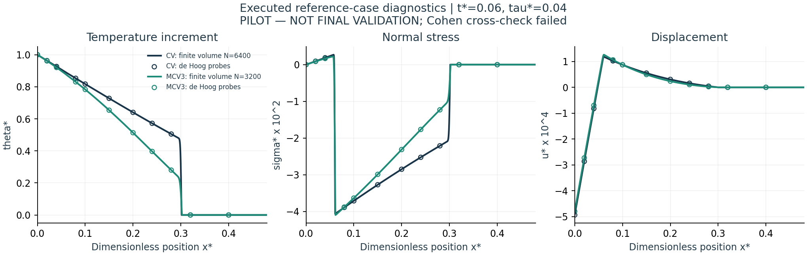

# Huang2025 CV/MCV3 reference pilot — completion/blocker report

**Date:**30 September2026  
**PHASE:** bounded Phase0A-2 reference-case feasibility pilot only  
**STATUS:** **BLOCKED — frozen inversion cross-check failed after two pilot iterations.**  
**Label:** PILOT — NOT FINAL VALIDATION.

The user authorized only the stated CV+MCV3 reference pilot. No beta-Ga2O3/ellipse production, final research direction, journal or submission is approved. Numerical results below were actually executed; they are not experiments or physically validated new-material predictions.

## 1. Completed work and fixed inputs

- Frozen plan/input/source/reference hashes recorded **before numerical solver outputs** in PLAN_FREEZE_RECORD.json.
- Source B01Table2/Eqs44–66/Fig5, DOI10.1007/s10483-025-3280-7; t*=.06,tau*=.04, semi-infinite1D heated freeend.
- Same reported lambda77.6GPa,mu38.6GPa,alpha1.78e-5interpreted1/K,rho8945,cE381,T0293; zero causalprehistory. No parameter fitting.
- Implemented closed Laplace response, independent spatial-matrix modes and an independently coded time-domain characteristic finite-volume model. MCV3 uses the documented equivalent two-CV-channel representation.
- Forty deterministic equation/constitutive/matrix/root-swap checks,7finite-volume runs, inversion degree/algorithm probes and actual runtime/provenance records.

## 2. What passed — limited numerical scope

| Executed check | Observed result | Interpretation |
|---|---:|---|
| Momentum residual maximum | 2.640e-16 | PASS at tested Laplace samples |
| Energy-equation residual maximum | 1.114e-15 | PASS at tested Laplace samples |
| Stress-law residual maximum | 2.954e-16 | PASS at tested samples |
| Independent spatial-matrix vs closed transform | 4.918e-14 scaled | PASS; not a physical experiment |
| de Hoogdegree48/64 probe change | <=3.313e-16 scaled | PASS only at specified off-front probes |
| Existing de Hoog/FVM probe diagnostic | <=8.025e-06 load-scaled | Strong partial consistency on14probes; not full-profile acceptance |

Source scales used (defined before results):S_theta=1,S_sigma=b,S_u=b*t/beta2. These normalized absolute errors are NOT percentages relative to small values/zero crossings.

## 3. Corrections and failures — history preserved

**Iteration1:** basic equation tests passed. InitialCV800/1600/3200 refinement left theta/stress finest-pair point changes above frozen3e-3. Inversion routine aborted at identically zero boundary stress because de HoogQ-D divides0/0.

**Logged correction:** keep the zero-stress source identity only atx=0; no interior/tail clipping. Originalcode/error/stagelog saved. Add a CV6400mesh as a **post-result diagnostic**, not pretend it was prespecified. Source parameters, front mask and error criteria unchanged.

**Iteration2:** the endpoint failure resolved; CV3200->6400 changes met the original criterion. de Hoogdegree48/64 was stable. But **Cohen80 failed the fixed5e-5 algorithm criterion for all six model/QoI combinations**, returning huge inconsistent values.

Example atx*=0.15:CVtheta(deHoog64)=0.727873830897, but Cohen80=397200410.456. This failed output is recorded for debugging and must not be interpreted as a real temperature prediction.

Root cause of the Cohen failure is **NOT ESTABLISHED**. Poor suitability/instability for these delayed/oscillatory transforms is a hypothesis; an implementation/library/precision issue must still be excluded. Do not assert the material/model is inadmissible on this evidence alone.

Because the frozen critical inversion gate still did not pass after two pilot iterations, additional solver runs were stopped under v2.1Section77. Report/diagnostic plots use only already-computed data. No criterion was loosened and no source parameter was tuned.

## 4. Remaining unexecuted checks / claim limits

- Full-profile Laplace/FVM acceptance:NOT_EXECUTED. Stored off-front probes were compared only as post-failure diagnostics.
- PublishedFigure5 graphical agreement:NOT_EXECUTED; source raster digitization prepared beforehand but prerequisite numerical gate unresolved.
- Whole scientific-model thermodynamics/well-posedness/tensor extension:NOT_CERTIFIED.
- Physical validation, new material, ellipse, novelty/significance/journal fit:NOT_EXECUTED/NOT_APPROVED.
- A good boundary residual or selected-probe agreement cannot justify overriding the failed frozen cross-check.

## 5. Actual computation and outputs

Measured accumulated stage CPU before report generation:49.061s (0.818CPU-min); additionalreport-onlyprocessing recorded separately. Approvedcap1800s;10ssetupallowance is an accounting reserve, not observed solver time. PeakrecordedRSS:46.6MiB. NoGPU.

Executed commands:
```bash
OPENBLAS_NUM_THREADS=1 OMP_NUM_THREADS=1 python run_basic_checks.py
OPENBLAS_NUM_THREADS=1 OMP_NUM_THREADS=1 python run_fvm.py
OPENBLAS_NUM_THREADS=1 OMP_NUM_THREADS=1 python run_inverse_probes.py # initial abort preserved
OPENBLAS_NUM_THREADS=1 OMP_NUM_THREADS=1 python run_fvm_extension.py
OPENBLAS_NUM_THREADS=1 OMP_NUM_THREADS=1 python run_inverse_probes.py # corrected driver, Cohen scientific FAIL
OPENBLAS_NUM_THREADS=1 OMP_NUM_THREADS=1 python summarize_existing_diagnostics.py
```

No further solve should be invoked automatically. Available artifacts:Pythoncode,case_input.json,frozenplan/hash,stageCPU/code/environmentlogs,NPZfinite-volumeoutputs,inversionprobeJSON,CSVowncomputedprobes,initial/correctedfailurehistory,PILOT_RESULTS.xlsx and diagnosticfigures.

The attached own-profile figure shows executed FVMcurves plus storeddeHoogprobe markers only. It contains no experimental/photo or copyrightedsourceplot overlay. Cohenfaileddata are not plotted as meaningful thermal fields.



## 6. User decision required — no automatic continuation

Options:
1. **Authorize diagnostic-only follow-up** to localize why Cohen fails and test a justified independent inversion/check within a new explicit plan/budget. Preserve failures; source values remain fixed.
2. **Authorize a documented post-result method-plan revision**:use convergeddeHoog plus the stronger independenttime-domainPDE evidence, or a suitable replacement inversion, then complete full-profile and published-reference comparison. Do not silently delete the failedCohencriterion or present an amended test as originallyprespecified.
3. Pause this route. No production/manuscript/new-material step depends on a falsely declared PASS.

**Exact next action:** STOP. Wait for user decision and explicitly authorized diagnostic/amended-scope phase.

## 7. Phase completion record

**Completed:** controlledimplementation,limited tests/refinements,actualrun/provenance,partial diagnostic evidence and savedblocker.  
**Scientific acceptance:** frozenpilotcross-check NOT_MET; new-projectacceptance notestablished.  
**Verification:** PARTIAL; individualpasses/scopes as above.  
**Physical validation:** NOT_RUN.  
**Code:** IMPLEMENTED_AND_EXECUTED for the pilot; originalFEM4/sourcePDFs unchanged.  
**Compute:** actuallimitedrunswithincap; completeledgerinlogs.  
**Rejected shortcuts:** parameter/criterion tuning, maskingfailures, forcingliteratureagreement.  
**Impact on prior work:** no existing scientificresults altered; newpilot findings only.  
**Files:** PILOT_REPORT.md/.html,PILOT_RESULTS.xlsx,src/,run scripts,case_input.json,PLAN_FREEZE_RECORD.json,data/,logs/,PILOT_CHANGELOG.md.  
**Cumulative package:** RECOVERY_PILOT_HUANG_2025_01.zip; ownpilotartifacts/currentcontrol plus priornotes; protectedsourceimages/PDFs/figure-derivedreferencetableexcluded. Not a finalresearch/offline-complete literature archive.  
**Next phase:** notapproved; diagnosticdecisionneeded.
